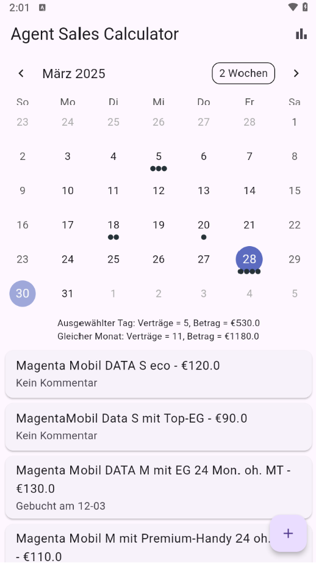
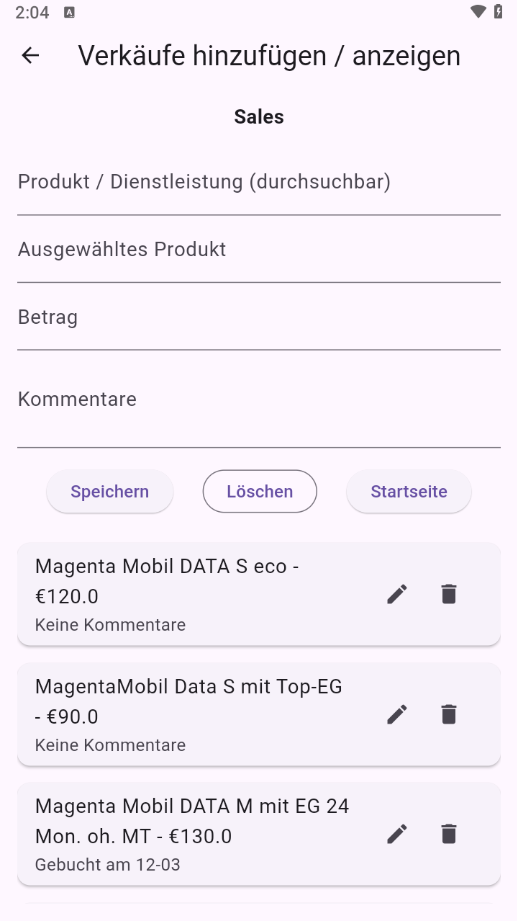
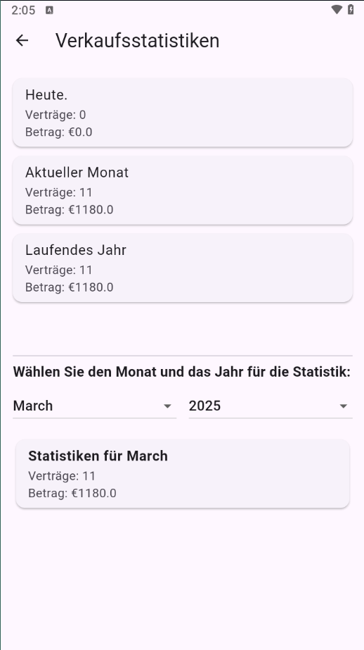

# 📊 Sales Tracker

**Sales Tracker** is a Flutter-based mobile app that allows you to track and manage product sales by date. It features local data persistence using Hive and provides a clean, calendar-based UI to help you log, view, and analyze your sales easily.

## ✨ Features

- 📅 Track sales with calendar view
- 💾 Persistent local storage with Hive
- 📦 Load product list from a local JSON file
- 📈 View statistics and history of sales
- 🇩🇪 Full German language support

## 📸 Screenshots


| Home Screen | Sale | Static |
|-------------|----------|----------|
|  |  |  |

## 🚀 Getting Started

1. **Clone the repository:**

```bash
git clone https://github.com/Nissmoline/sales_tracker.git
cd sales_tracker
```

2. **Install dependencies:**

```bash
flutter pub get
```

3. **(Optional) Generate the app icon:**

```bash
flutter pub run flutter_launcher_icons:main
```

4. **Run the app:**

```bash
flutter run
```

## 📦 Build APK

To generate the release `.apk`:

```bash
flutter build apk --release
```

The APK will be located in:  
`build/app/outputs/flutter-apk/app-release.apk`

## 🗂 Project Structure

- `models/` – Data models (Sale, Product)
- `providers/` – State management using Provider
- `screens/` – Application UI screens
- `assets/` – JSON data and icons
- `main.dart` – Application entry point

## 🧰 Tech Stack

- **Flutter** – UI framework
- **Provider** – State management
- **Hive** – Lightweight local database
- **Table Calendar** – Calendar widget
- **Intl** – Localization
- **Path Provider** – Access local directories

## 📝 License

MIT © [Nissmoline](https://github.com/Nissmoline)

---

Made with ❤️ by Konstantine !